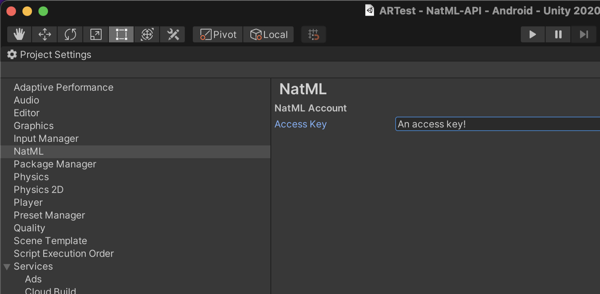

# NatCorder
NatCorder is a high performance, cross-platform video recording API for Unity Engine. First, create a recorder:
```csharp
// Create a recorder
var recorder = new GIFRecorder(
    640,  // image width
    480,  // image height
    0.1   // frame duration
);
```
Next, commit a bunch of video and/or audio frames to the recorder:
```csharp
// Commit video frames
Texture2D[] frames = ...;
foreach (var frame in frames)
    recorder.CommitFrame(frame.GetPixels32());
```
And when you're all done, finish writing and use the video as you desire:
```csharp
// Finish recording
string videoPath = await recorder.FinishWriting();
```

NatCorder comes with a rich featureset including:

+ Record any texture, anything that can be rendered into a texture, or any pixel data.
+ Record to MP4 videos and animated GIF images.
+ Control recording quality and file size with bitrate and keyframe interval.
+ Record at any resolution. You can specify what resolution recording you want.
+ Get the path to recorded video in device storage.
+ Record game audio with video.
+ Support for recording HEVC videos.
+ Support for Android, iOS, macOS, WebGL, and Windows.

See the [online docs](https://docs.natml.ai/natcorder) to learn more about NatCorder.

## Installing NatCorder
First, add the following items to your Unity project's `Packages/manifest.json`:
```json
{
  "scopedRegistries": [
    {
      "name": "NatML",
      "url": "https://registry.npmjs.com",
      "scopes": ["ai.natml"]
    }
  ],
  "dependencies": {
    "ai.natml.natcorder": "1.9.4"
  }
}
```
Then retrieve your access key from [NatML Hub](https://hub.natml.ai/profile) and add it to your Project Settings:



> Using NatCorder requires an active [NatML VideoKit](https://www.natml.ai/videokit) subscription. You can try it out for free, but functionality is limited. [See the docs](https://docs.natml.ai/natcorder/prelims/faq) for more info.

___

## Requirements
- Unity 2021.2+

## Supported Platforms
- Android API Level 24+
- iOS 14+
- macOS 10.15+ (Apple Silicon and Intel)
- Windows 10+ (64-bit only)
- WebGL:
  - Chrome 91+
  - Firefox 90+

## Resources
- Join the [NatML community on Discord](https://natml.ai/community).
- See the [NatCorder documentation](https://docs.natml.ai/natcorder).
- Check out [NatML on GitHub](https://github.com/natmlx).
- Read the [NatML blog](https://blog.natml.ai/).
- Contact us at [hi@natml.ai](mailto:hi@natml.ai).